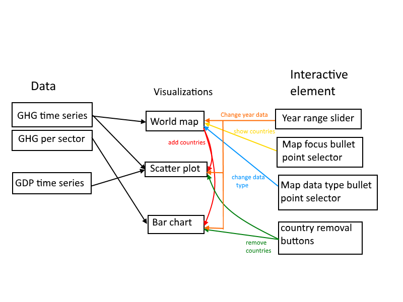

# Design  

### Data
##### Data sources
- http://di.unfccc.int/time_series.
From this link all relevant data can be found but only for the UN nations.
Time series data for every type of greenhouse gas and emissions per sector
for UN countries can be found here.

- http://edgar.jrc.ec.europa.eu/overview.php?v=42FT2012
This link leads to data for GHG emissions in a larger number of countries but
only includes the time series for CO2, CH4, N2O and F-gasses but no information
on emission source. The same datasets are also available with emission per
capita and per GDP for every country.

- https://data.worldbank.org/indicator/NY.GDP.MKTP.CD
From this link, time series data for GDP for countries over the years can be
found.

##### Data reworking
The data for GHG emissions is given in excel files (.xlsx).
For CO2 the data is given in kilotons (kt) and for the other gasses
in equivalent kilotons of CO2 (kt CO2 equivalent).

The data for the GDP is a csv, which can be directly read by d3, but could first
be converted to a json.

All data sources should be trimmed to only contain the relevant data. Then the
data files can be saves as .csv after which a script can create usable jsons for
the visualisations.

##### json structure
###### World map and scatterplot
```
[
  {
    year: 1970
    countryCode:  
    {
      Name: Country name
      GDP: value USD,
      GHG: value kt CO2 equivalent
    }
    countryCode:
    {
      Name: Country name
      GDP: value USD,
      GHG: value kt CO2 equivalent
    }
  }
 {
   {
     year: 1971
     countryCode:  
     {
       Name: Country name
       GDP: value USD,
       GHG: value kt CO2 equivalent
     }
     countryCode:
     {
       Name: Country name
       GDP: value USD,
       GHG: value kt CO2 equivalent
     }
   }
 }
... etc
]
```


### Scripts and functions
##### Scripts
- Script(s) to convert a datasource to json in python.
- A script for the graphs in JavaScript
##### Functions
- A function to read in all the jsons created by the python script
- every graph will have its own function
- every interactive element will have its own update function

### Design diagram


### Possible required plugins
- python
- D3
- D3 tooltip
- topojson
- datamaps
