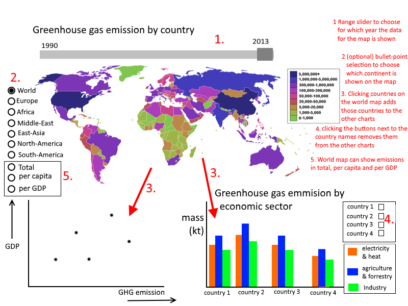

# progProject readme

## Problem
Relate the greenhouse gas emissions of the world by emission source and type
of gas.

## Solution
Visualization for greenhouse gas emission by country over time, greenhouse gas
emission by source, and the fractions of greenhouse gasses emitted from the
total greenhouse gas emission.

#### Features
- Chart 1: The greenhouse gas emission by country over time. This can be
visualized by a map chart coloring the countries by either their
total greenhouse gas emission, the greenhouse gas emission per capita or the
greenhouse gas emission per GDP.

- The time element of chart 1 can be interactive by having the user have control
over a range slider or a scroll bar that determines which data of a year will be
shown.

- In chart 1, a tooltip will show a country's true data value. This will allow
the user to get to know the exact data value of emission for a country instead
of having to guess it off the color in the legend.

- Chart 2: The greenhouse gas emission by source.
This can be visualized by a bar chart.

- Chart 3: A scatterplot relating a country's GDP to its GHG emissions.

- Clicking countries on the world map will show data for those
countries in the other charts. In a menu to the side, these countries can
be removed from the charts.

- (optional) Via a bullet-point selection the user can choose which continent
is shown in chart 1. The user will then have the option to "zoom in" to
a particular continent.

#### Sketch

## Prerequisites
#### Possible sources
- http://unfccc.int/ghg_data/ghg_data_unfccc/items/4146.php
- http://edgar.jrc.ec.europa.eu/overview.php?v=CO2ts1990-2015#
- http://di.unfccc.int/time_series
 (multiple data sources. Can be used for emission per sector)

#### External components
Most, if not all, visualizations will be made in JavaScript using d3. These
scripts will then be loaded in by a html page.

#### Difficulties
- There might not be data for every country for chart 2 and 3.
- For chart 2, only data on UN countries were found. Perhaps this chart could be
unlinked from the world map, but have a checkbox selection with the UN countries
instead.
