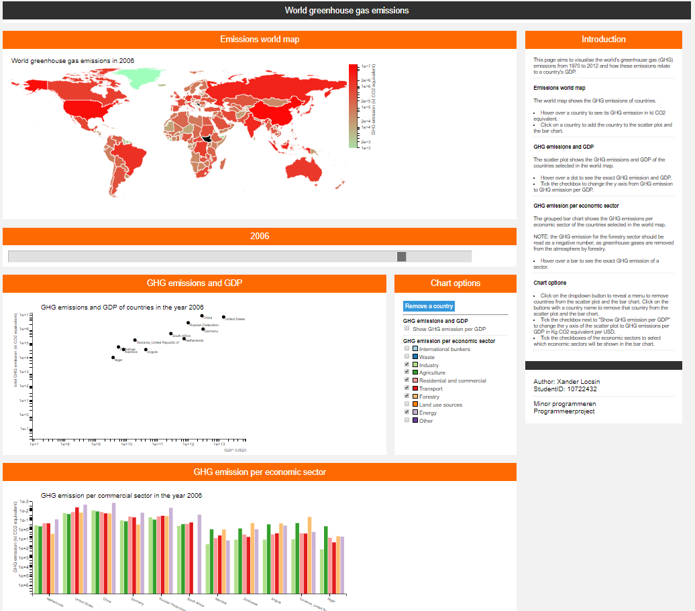

# Final report
## Description
### Method
The page aims to visualise the world's greenhouse gas (GHG) emissions from 1970
to 2012 and how these emissions relate to a country's GDP. This is done by
a world map for the world's greenhouse gas emissions, a grouped bar chart for
greenhouse gas emission per country by source (economic sector), and a
scatterplot for greenhouse gas emission and country GDP.

### Functionality
- The world map shows the GHG emission of countries for a specific year.
- The scatter plot shows GDP and GHG emissions for various countries.
- The bar chart shows GHG emission per economic sector for various countries.
- The slider can be used to change for which year the data is shown in all
visualisations.
- Clicking on countries on the world map adds those countries to the bar chart
and the scatter plot.
- Countries can be removed from the bar chart and the scatter plot via a
dropdown menu with buttons.
- Via a checkbox the y axis of the scatter plot can be changed to GHG emission
per GDP.
- Via a checkbox list the economic sectors that will be shown in the scatter
plot can be selected. This checkbox list also doubles as a legend for the
scatter plot.
- Hovering over countries, dots, and bars will show the specific data for that
country, dot or bar.

## Design
### Scripts
#### convertCSV2JSON
A script to convert a datasource to json in python.

#### visualisations.js
A script to create the graphs for progProject.html
- The script first initialises the interactive elements and defines some
global variables.
- Functions are then defined.
- Then data is loaded in and the charts are created.
- The "to plot" lists/variables that define what gets shown in the plots are
global variables. These are:
  - yearIndex: index to determine of which year the data is shown.
  - countryPlotList: A list to determine which countries are shown in the
  scatter plot and the bar chart.
  - sectorPlotList: A list to determine which sectors are shown in the bar
  chart.
- Every interactive element, except the scatterplot y axis change, will change a
 "to plot" variable in some way. When these elements are manipulated the
relevant global "to plot" variables are updated, after which the relevant
viualisations are updated.

### Python functions
- function valueTest checks if a given value can be converted to float to ensure
it is a number.
- function getData retrieves all relevant information from allData.json.

### JavaScript functions
- All functions are defined in visualisations.js.
- Every interactive element updates the global "to plot" variables, immediately
thereafter the relevant visualisations are updated.
- Every visualisation has an update function which removes and recreates a chart
based on the global "to plot" variables.
- function minMaxFinder finds the minimum and maximum value of the GDP, the GHG
emissions and the GHG emissions per sector in the data. This function returns
the minima and maxima in a list.
- function changeYearTexts changes the mentions of the year in text to an other
year.
- function updateMap: This function updates the world map's country's colours
and the datamaps data to data of an other year.
- function updateScatter: This function updates the scatter plot to data
of a different year, and for different selections of countries.
- function updateBar updates the bar chart to different selections of year,
countries and sectors.
- function getSectorChecks creates a list of the elements checked in the sector
selection checkbox menu/legend.
- function getBoxCheck checks if a specific box is checked. This function is
used by getSectorChecks.
- function removeDropdownWriter clears the dropdown buttons to remove countries
and remakes the list with a different selection of countries.
- function countryRemove removes a country from the "to plot" list.

## Developments
- Initially, one of the visualisations was planned to be a pie chart showing
which gasses the emitted greenhouse gasses were composed of. This chart did not
tie in well with the overall story the page was meant to tell so this chart was
switched out for a scatterplot that relates the GHG emission of a country to
the GDP. This chart can show how efficient a country is in generating GDP with
respect to its GHG emission.
- At first the intention was to create a different data json file for every
visualisation. Every data json file could use the same structure which allowed
all relevant data to be able to be collected into a single json file.
- GHG emission values vary significantly. Plotting these into the visualisations
required large axis/colour ranges because some values were significantly large
relative to others. This resulted in many dots/countries/bars getting grouped
near the axes of the charts. The outliers caused the ranges to stretch.
To "spread out" the data over the visualisations, all axis and colour scales
were changed to log scales so an even distribution of colours, dots and bars
were seen in the visualisations while still showing whether GHG emissions
increased or decreased.
